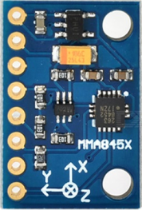

# MMA8452Q-Library

This library provides full functionality of the MMA8452Q accelerometer over I2C on an ATmega328P 8-bit AVR Microcontroller.

  

## Software

* Atmel Studio 6.0 - Integrated Development Platform for developing and debugging AVR microcontrollers.

## License

This project is licensed under the MIT License - see the [LICENSE.md](LICENSE.md) file for details.
